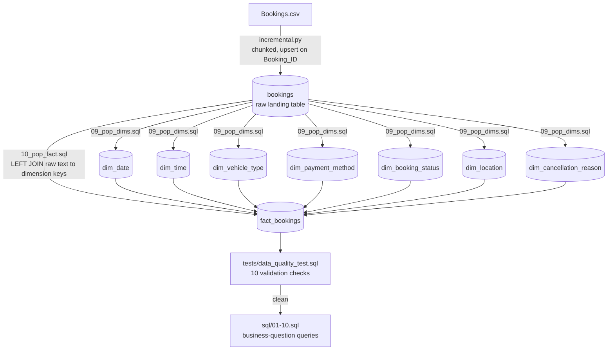
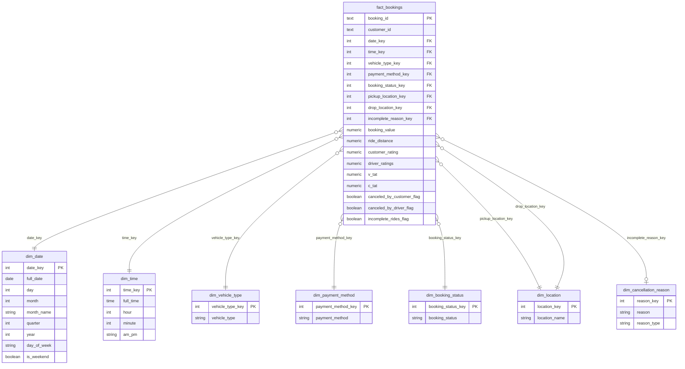
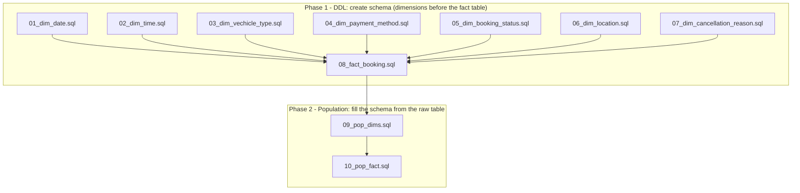
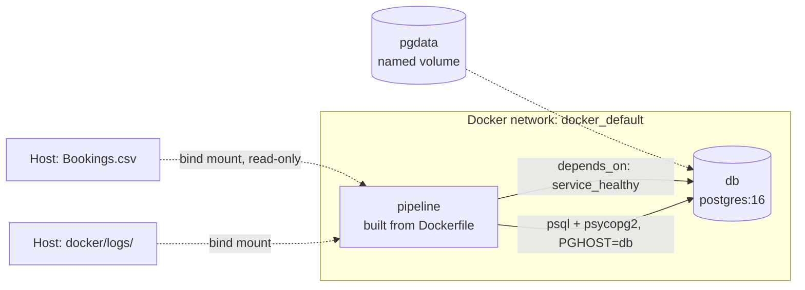

# UBER Bookings Analytics Pipeline

**A production-style Postgres ELT pipeline that turns a raw ride-bookings CSV into a Kimball-style star schema — built for correctness, idempotency, and analytical speed.**


The project's center of gravity is the data model itself — everything else (Docker orchestration, the incremental loader, the quality-test suite) exists to get data into that model safely and keep it trustworthy.

---

## Why This Project

- **Dimensional modeling done deliberately.** Every design choice — surrogate vs. smart keys, role-playing dimensions, degenerate dimensions, SCD strategy — is documented with the tradeoff it accepts, not just the outcome.
- **Idempotent by construction.** The loader, dimension population, and fact population can all be re-run safely at any point in the pipeline without producing duplicates or corrupting state.
- **Reproducible anywhere.** `docker compose up` guarantees the same Postgres version, same Python environment, and same run sequence on any machine — no local setup required beyond Docker.
- **Quality-gated.** Ten documented SQL checks validate completeness, uniqueness, referential integrity, value sanity, and business logic before the data is considered analytics-ready.
- **Honest documentation.** Known inconsistencies between docs and code are tracked explicitly (Section 7) rather than hidden.

---

## At a Glance

| | |
|---|---|
| Business process modeled | A single ride booking |
| Grain | One row in `fact_bookings` = one booking (`booking_id`) |
| Modeling style | Kimball dimensional modeling (star schema), not 3NF |
| Dimensions | 7 (`dim_date`, `dim_time`, `dim_vehicle_type`, `dim_payment_method`, `dim_booking_status`, `dim_location` ×2 roles, `dim_cancellation_reason`) |
| Measures | 9 (3 additive, 2 semi-additive, 2 non-additive, 2 boolean-derived) plus 3 outcome flags |
| Layers | Raw landing (`bookings`) → Star schema (`fact_bookings` + `dim_*`) → Validation → Analytics queries |
| Orchestration | Docker Compose (`db` + `pipeline` services), or native Windows via `uv` |
| Data quality checks | 10 documented SQL tests across 5 categories |

---

## 1. End-to-End Data Flow



Two layers exist on purpose, and keeping them separate is itself a modeling decision:

| Layer | Table(s) | Purpose |
|---|---|---|
| Raw / landing | `bookings` | Exact, denormalized copy of the CSV. Nothing is modeled here — it exists so the source of truth is always easy to re-load and debug against. |
| Star schema / analytics | `fact_bookings` + `dim_*` | The queryable model. Text values (`"Cash"`, `"Sedan"`, `"Cancelled"`) are replaced with small integer keys. |
| Audit | `etl_load_log` | Tracks loader runs (rows read/inserted/skipped), independent of the schema above. |

Because the star schema is rebuilt from the untouched raw table (`09_pop_dims.sql` → `10_pop_fact.sql`), a modeling mistake never corrupts the source of truth — the whole star schema can be dropped and rebuilt at any time.

---

## 2. Data Modeling — the Core of This Project

### 2.1 Why a Star Schema, Not 3NF

| | 3NF (normalized) | Star schema (this project) |
|---|---|---|
| Optimized for | Transactional writes, no redundancy | Analytical reads, fast aggregation |
| Joins for a typical report | Many, often nested | One hop from fact to each dimension |
| Fits the actual query pattern | No — this isn't a transactional system | Yes — "revenue by vehicle type, by day, by payment method" is exactly what a star schema is built for |

### 2.2 The Four-Step Kimball Process, as Applied Here

| Step | Decision |
|---|---|
| 1. Select the business process | Bookings — not customers, not drivers |
| 2. Declare the grain | One row in `fact_bookings` = one booking, enforced structurally via `booking_id PRIMARY KEY` |
| 3. Identify the dimensions | `dim_date`, `dim_time`, `dim_vehicle_type`, `dim_payment_method`, `dim_booking_status`, `dim_location` (×2 roles), `dim_cancellation_reason` |
| 4. Identify the facts | `booking_value`, `ride_distance`, `customer_rating`, `driver_ratings`, `v_tat`, `c_tat`, plus 3 boolean outcome flags |

The order matters: dimensions and facts are only defined once the grain is locked. Had the grain been "one row per status-change event" instead of "one row per booking," almost every dimension and fact below would change.

### 2.3 Entity-Relationship Diagram



All eight foreign keys use `ON UPDATE NO ACTION / ON DELETE NO ACTION` — Postgres blocks deleting or renaming a dimension row that's still referenced by a fact row.

### 2.4 Key Design Decisions and Their Tradeoffs

| Decision | What was done | Why | Tradeoff accepted |
|---|---|---|---|
| Surrogate vs. smart keys | Most dimensions use a `SERIAL` surrogate key. `dim_date`/`dim_time` deliberately break this pattern and use a smart key (`20240115`, `1430`) | Smart keys can be computed directly from source data without a lookup join, and are human-readable in ad-hoc queries | If the date/time format ever changes, that format is baked into every fact row — a surrogate key would have been insulated from this |
| Degenerate dimensions | `booking_id` and `customer_id` live directly on `fact_bookings`, not in their own dimension tables | `booking_id` is the grain itself — a dimension of it would be a 1:1 copy of the fact table. `customer_id` has no attributes worth modeling yet | If customer attributes (name, tier, signup date) are added later, a real `dim_customer` becomes worth splitting out |
| Role-playing dimension | One `dim_location` table, referenced twice (`pickup_location_key`, `drop_location_key`) | A location is the same real-world entity whether it's a pickup or drop point | Every query using both roles has to alias and join `dim_location` twice |
| Flags instead of a junk dimension | `canceled_by_customer_flag`, `canceled_by_driver_flag`, `incomplete_rides_flag` are plain booleans on the fact table | Three booleans don't meaningfully widen the fact table, and inline filtering is simpler than joining out | Worth revisiting if many more categorical flags get added later |
| No SCD handling | Every dimension insert is "insert if not already present" via `ON CONFLICT (...) DO NOTHING` | Vehicle types, payment methods, and location names aren't expected to change meaning over time | Effectively SCD Type 0/1 — no history. If a dimension's meaning ever needs to change while preserving historical accuracy, this design overwrites forward rather than preserving the old association |

### 2.5 Measure Additivity

Not every numeric column on `fact_bookings` can be summed meaningfully — this governs how `sql/01-10.sql` is written:

| Measure | Behavior | Correct aggregation |
|---|---|---|
| `booking_value`, `ride_distance` | Fully additive | `SUM()` across any dimension |
| `v_tat`, `c_tat` | Semi-additive | `AVG()` — summing turnaround time across bookings isn't meaningful |
| `customer_rating`, `driver_ratings` | Non-additive | `AVG()` or a bucketed distribution only, never `SUM()` |

---

## 3. Build Order and Dependencies

The `model/` folder's numeric prefixes encode a hard dependency order driven by the foreign keys in `08_fact_booking.sql`.



Postgres refuses to create `fact_bookings` before its seven referenced dimension tables exist, so 01–07 must run first. Dimensions must then be *populated* (09) before the fact table can be populated (10), because every row in `10_pop_fact.sql` does a `LEFT JOIN` against each dimension to translate raw text into a surrogate key — an empty dimension means every one of those lookups returns `NULL`, which is exactly what Data Quality Tests 3 and 5 are designed to catch.

The full chain is idempotent end to end: `incremental.py` upserts on `Booking_ID`; `09_pop_dims.sql` uses `ON CONFLICT (...) DO NOTHING` on every dimension insert; `10_pop_fact.sql` adds a `WHERE NOT EXISTS` filter plus `ON CONFLICT (booking_id) DO NOTHING` as a safety net. That's what makes it safe to run on a schedule via an orchestrator (cron, Airflow, Dagster) rather than by hand.

---

## 4. Orchestration: Docker



`docker compose up` gives the same Postgres version, same Python/package versions, and same run sequence on any machine — nothing needs to be pre-installed except Docker itself.

`docker/Entrypoint.sh` runs five steps in strict order, stopping on the first failure:

| Step | Runs | Purpose |
|---|---|---|
| 0/5 | `model/01_*.sql` → `08_*.sql` | Creates dimension + fact table schema (idempotent, `CREATE TABLE IF NOT EXISTS`) |
| 1/5 | `scripts/incremental.py` | Loads new rows from the mounted CSV into `bookings`, skipping duplicates |
| 2/5 | `model/09_pop_dims.sql` | Populates dimensions from distinct values in `bookings` |
| 3/5 | `model/10_pop_fact.sql` | Populates `fact_bookings`, joining `bookings` against the now-populated dimensions |
| 4/5 | `scripts/data_quality_checks.py` | Runs quality checks and reports pass/fail |

Connection details are read under three variable-name conventions (`PGHOST`/`PGPORT`/…, `POSTGRES_HOST`/`POSTGRES_USERNAME`/…, and `PGOPTIONS`), all set to the same values by `compose.yml`. Notably, `PGHOST`/`POSTGRES_HOST` are hardcoded to `db` rather than read from `.env`, because inside the Compose network containers reach each other by service name — a `.env` value of `localhost` would otherwise point the `pipeline` container back at itself. `PGOPTIONS="-c datestyle=ISO,DMY"` exists because the source CSV's dates are `DD-MM-YYYY`, and Postgres's default `MDY` parsing would misread day values above 12 as an invalid month.

---

## 5. Data Quality Testing

Ten SQL checks validate the load, grouped into five categories:

| Category | Tests | Catches |
|---|---|---|
| Completeness | 1, 5 | Rows or dimension values silently dropped |
| Uniqueness | 2 | Duplicate loads |
| Referential integrity | 3, 4, 10 | Broken or missing links between fact and dimension tables |
| Value sanity | 6, 7 | Impossible numbers (negative values, out-of-range ratings) |
| Business logic | 8, 9 | Numbers that are individually valid but inconsistent together |

Recommended run order: Tests 1–2 first (row count, no duplicates), then 3, 4, 5, 10 (dimension links), then 6–7 (value ranges), then 8–9 (business logic, read by eye). If 1–5 and 10 aren't clean, 6–9 aren't worth interpreting yet — a broken join upstream can make later numbers look wrong for reasons unrelated to the actual data.

---

## 6. Repository Structure

```
UBER
├─ .dockerignore
├─ .python-version
├─ docker
│  ├─ compose.yml
│  ├─ Dockerfile
│  └─ Entrypoint.sh
├─ docs
│  ├─ architecture.md
│  ├─ data_quality.md
│  ├─ docker.md
│  ├─ incremental.md
│  └─ model.md
├─ LICENSE
├─ main.py
├─ model
│  ├─ 01_dim_date.sql
│  ├─ 02_dim_time.sql
│  ├─ 03_dim_vechicle_type.sql
│  ├─ 04_dim_payment_method.sql
│  ├─ 05_dim_booking_status.sql
│  ├─ 06_dim_location.sql
│  ├─ 07_dim_cancellation_reason.sql
│  ├─ 08_fact_booking.sql
│  ├─ 09_pop_dims.sql
│  └─ 10_pop_fact.sql
├─ ps1
│  └─ pipeline.ps1
├─ pyproject.toml
├─ README.md
├─ scripts
│  ├─ data_quality_checks.py
│  └─ incremental.py
├─ sql
│  ├─ 01_booking_status_distribution.sql
│  ├─ 02_booking_revenue.sql
│  ├─ 03_daily_booking.sql
│  ├─ 04_turnaround_time.sql
│  ├─ 05_payment_method.sql
│  ├─ 06_incomplete_ride.sql
│  ├─ 07_rating.sql
│  ├─ 08_day_of_week.sql
│  ├─ 09_location.sql
│  └─ 10_cancellation_risk.sql
├─ tests
│  └─ data_quality_test.sql
├─ utils
│  ├─ db.py
│  └─ logger.py
└─ uv.lock
```

| Folder | Role |
|---|---|
| `docker/` | Compose orchestration, image build, container entrypoint |
| `docs/` | This document's source material — architecture rationale, model reference, loader, Docker, and quality-test docs |
| `model/` | DDL (dimensions + fact) and the two transform scripts that populate them from raw data |
| `scripts/` | Python: the incremental CSV loader and the automated quality checks |
| `sql/` | The business-question queries the whole model exists to answer |
| `tests/` | Standalone SQL test suite (10 checks) for manual/ad-hoc validation |
| `utils/` | Shared DB connection and logging helpers |
| `ps1/` | Native Windows equivalent of the Docker entrypoint sequence |

---

## 7. Known Issues / Documentation Inconsistencies

Flagging these rather than silently picking one, since the underlying docs disagree:

- **Raw table naming.** `data_quality.md`'s test queries reference a table called `booking` (singular), while `incremental.md`, `model.md`, and `docker.md` all consistently use `bookings` (plural). Confirm the actual table name before running the SQL tests as written, or Tests 1 and 5 will fail with "relation does not exist."
- **Quality-check count mismatch.** `docker.md` describes `scripts/data_quality_checks.py` (run inside the container) as performing 8 checks, while `data_quality.md` documents 10 SQL tests in `tests/data_quality_test.sql`. These read as two separate implementations — an automated Python version in the pipeline, and a fuller manual SQL suite — worth reconciling or at least confirming which is authoritative.
- **Filename typo.** `model/03_dim_vechicle_type.sql` is misspelled ("vechicle") in the repo tree itself. Cosmetic, but any script or doc referencing the literal filename needs to match it exactly.
- **Idempotency fix, already applied.** An earlier version of `09_pop_dims.sql` only had `ON CONFLICT (...) DO NOTHING` on the `dim_date` insert — the other five dimension inserts would abort with a duplicate-key error on a second run. `architecture.md` §6 states this is fixed; worth a quick check that the current file matches before relying on full-pipeline idempotency.

---

## 8. Getting Started — Cloning and Running This Repository

### Prerequisites

- Git
- Docker Desktop (recommended path)
- Optional, for the native Windows path: Python 3.13 and [`uv`](https://docs.astral.sh/uv/)

### Docker Path (Recommended)

1. Clone the repository:
   ```bash
   git clone <repository-url>
   cd UBER
   ```
2. Create a `.env` file inside `docker/` (same folder as `compose.yml`):
   ```dotenv
   # Postgres credentials, shared by both the db and pipeline services
   POSTGRES_USERNAME=uber_user
   POSTGRES_PASSWORD=change_me
   POSTGRES_DATABASE=uber_bookings

   # Loader configuration
   TABLE_NAME=bookings
   CHUNK_SIZE=5000

   # Host path to the source CSV - forward slashes only, even on Windows
   CSV_HOST_PATH=C:/UBER/data/Bookings.csv
   ```
   Do not hardcode `PGHOST`/`POSTGRES_HOST` — `compose.yml` sets these to `db` automatically so containers can reach each other by service name.
3. From inside `docker/`, build and run everything:
   ```bash
   docker compose up --build
   ```
   This starts Postgres, waits for it to pass its healthcheck, then runs the five-step pipeline (schema → load → populate dimensions → populate fact → quality checks) inside the `pipeline` container.
4. On later runs, once the image is built, you can skip the rebuild:
   ```bash
   docker compose up
   ```
5. Check `docker/logs/` for a timestamped run log, or query the audit table directly:
   ```bash
   docker compose run --rm pipeline psql -c "SELECT * FROM etl_load_log ORDER BY run_at DESC;"
   ```
6. To inspect the database without re-running the whole pipeline:
   ```bash
   docker compose up --build db
   ```
7. To stop everything while keeping your data:
   ```bash
   docker compose down
   ```
   To wipe the database completely:
   ```bash
   docker compose down -v
   ```

### Native Windows Path (No Docker)

1. Clone the repo and install dependencies with `uv`:
   ```powershell
   cd C:\UBER
   uv pip install -r requirements.txt
   ```
   or, if managing dependencies via `pyproject.toml`:
   ```powershell
   uv add pandas sqlalchemy psycopg2-binary python-dotenv
   ```
2. Create a `.env` at the project root (`C:\UBER\.env`) with your local Postgres connection details and CSV path — see `docs/incremental.md` for the full variable list.
3. Run the loader directly:
   ```powershell
   uv run scripts\incremental.py
   ```
4. Run the equivalent of the Docker entrypoint sequence via `ps1/pipeline.ps1`, or execute `model/01`–`10` and `scripts/data_quality_checks.py` manually against your local Postgres instance in that order.

Either path produces the same result: a `bookings` raw table and a `fact_bookings` + `dim_*` star schema in Postgres, ready for the queries in `sql/01`–`10`.

---

## 9. Future Enhancements

The current pipeline is deliberately scoped to batch CSV ingestion and manual scheduling. The items below are the natural next layers, grouped by the part of the stack they extend.

### Modeling

| Enhancement | Rationale |
|---|---|
| SCD Type 2 for `dim_vehicle_type`, `dim_payment_method`, `dim_location` | The current design (SCD 0/1) overwrites forward with no history. Type 2 would preserve prior associations if a dimension's meaning changes over time. |
| Promote `customer_id` to a full `dim_customer` | Currently a degenerate dimension because no customer attributes exist yet. Worth splitting out once tier, signup date, or demographic data is available. |
| Conformed date/time dimensions shared across future fact tables | Positions the warehouse for additional business processes (e.g., driver payouts, support tickets) without redefining `dim_date`/`dim_time` each time. |

### Orchestration & Reliability

| Enhancement | Rationale |
|---|---|
| Replace `Entrypoint.sh` with Airflow or Dagster DAGs | Gives dependency-aware scheduling, retries, alerting, and a visual run history instead of a single shell script that stops on first failure. |
| GitHub Actions CI workflow | Run the 10 SQL quality tests and a schema-build smoke test automatically on every push or pull request, catching regressions before merge. |
| Migrate `09_pop_dims.sql` / `10_pop_fact.sql` into dbt models | Would add automatic lineage graphs, built-in test macros (`unique`, `not_null`, `relationships`), and generated documentation — replacing hand-maintained SQL and docs with a single source of truth. |

### Data Quality & Observability

| Enhancement | Rationale |
|---|---|
| Reconcile the 8-check vs. 10-check discrepancy (Section 7) into one authoritative suite | Removes ambiguity about which implementation is canonical. |
| Adopt Great Expectations or dbt tests for the quality layer | Adds automated pass/fail reporting, historical trend tracking, and alerting on top of the current manual SQL checks. |
| Structured logging and metrics export from `etl_load_log` | Feed load metrics into a lightweight dashboard (rows loaded, skip rate, run duration) to spot ingestion drift early. |

### Analytics & Consumption

| Enhancement | Rationale |
|---|---|
| Power BI or Metabase dashboard on top of the star schema | Turns `sql/01`–`10` from static queries into a live, filterable reporting layer for non-technical stakeholders. |
| Semantic layer via dbt metrics or a BI-tool semantic model | Codifies the additivity rules from Section 2.5 (e.g., "always AVG turnaround time") so downstream tools can't misuse the measures. |

### Platform & Scale

| Enhancement | Rationale |
|---|---|
| Kafka-based CDC ingestion alongside the batch CSV loader | Moves the pipeline toward near-real-time booking updates rather than periodic full-file drops. |
| Cloud-native deployment (AWS RDS for Postgres, S3 for raw file archival, ECS/EKS for the pipeline container) | Removes the local-Docker constraint and enables scheduled, managed runs in production. |
| Data catalog integration (e.g., OpenMetadata) | Auto-documents the warehouse schema and lineage, reducing reliance on manually maintained docs as the model grows. |

---

## License

Distributed under the MIT License. See `LICENSE` for details.
