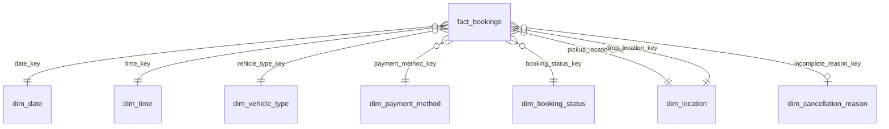

# Data Model

This document explains how the tables in the `bookings` database are structured and how they relate to each other. The schema is a **star schema**: one central fact table (`fact_bookings`) surrounded by dimension tables (`dim_*`), plus a separate raw landing table (`bookings`) and an audit table (`etl_load_log`).

## Architecture overview

```
Bookings.csv
    │
    ▼
public.bookings            <- raw landing table (1 row per CSV row, loaded incrementally)
    │
    │  (transform / ETL — not shown in this ERD)
    ▼
public.fact_bookings  ───┬──► dim_date
                          ├──► dim_time
                          ├──► dim_vehicle_type
                          ├──► dim_payment_method
                          ├──► dim_booking_status
                          ├──► dim_location   (pickup)
                          ├──► dim_location   (drop)
                          └──► dim_cancellation_reason
```

Two layers exist on purpose:

| Layer | Table(s) | Purpose |
|---|---|---|
| **Raw / landing** | `bookings` | Exact copy of the CSV, one row per `Booking_ID`. This is what the incremental loader script writes to. Nothing here is normalized. |
| **Star schema / analytics** | `fact_bookings` + `dim_*` | Normalized, query-friendly model for reporting/BI. Text values (e.g. `"Cash"`, `"Cancelled"`, `"Sedan"`) are replaced with small integer keys pointing at dimension tables. |
| **Audit** | `etl_load_log` | Tracks every load run (rows read / inserted / skipped), independent of the schema above. |

The `bookings` raw table isn't foreign-keyed to `fact_bookings` — they share the same natural key (`Booking_ID`), but a transform step (outside this ERD) is what turns raw rows into fact + dimension rows.

## Fact table: `fact_bookings`

One row per booking. `booking_id` is both the primary key and the same natural key used in the raw `bookings` table.

| Column | Type | Description |
|---|---|---|
| `booking_id` | text (PK) | Natural key, same value as `bookings."Booking_ID"` |
| `customer_id` | text | Who made the booking |
| `date_key` | int (FK → `dim_date`) | Booking date |
| `time_key` | int (FK → `dim_time`) | Booking time |
| `vehicle_type_key` | int (FK → `dim_vehicle_type`) | Vehicle used |
| `payment_method_key` | int (FK → `dim_payment_method`) | How the ride was paid for |
| `booking_status_key` | int (FK → `dim_booking_status`) | Completed / Cancelled / Incomplete, etc. |
| `pickup_location_key` | int (FK → `dim_location`) | Pickup point |
| `drop_location_key` | int (FK → `dim_location`) | Drop-off point |
| `incomplete_reason_key` | int (FK → `dim_cancellation_reason`) | Why a ride was cancelled/incomplete (nullable — only set when relevant) |
| `booking_value` | numeric(10,2) | Fare amount |
| `ride_distance` | numeric(10,2) | Distance travelled |
| `customer_rating` / `driver_ratings` | numeric(3,2) | Ratings (0.00–5.00 range) |
| `v_tat` / `c_tat` | numeric(10,2) | Vehicle / Customer turnaround time |
| `canceled_by_customer_flag` / `canceled_by_driver_flag` / `incomplete_rides_flag` | boolean | Simplified flags derived from the raw text columns |

**Grain**: one row = one booking. Same grain as the raw `bookings` table.

## Dimension tables

Each dimension holds the distinct values of one attribute, so the fact table can store a small integer instead of repeating text on every row.

| Table | Key | Unique business column | Notes |
|---|---|---|---|
| `dim_date` | `date_key` (int) | `full_date` | Also stores pre-computed `day`, `month`, `month_name`, `quarter`, `year`, `day_of_week`, `is_weekend` so reports don't need date math at query time |
| `dim_time` | `time_key` (int) | `full_time` | Stores `hour`, `minute`, `am_pm` alongside the raw time |
| `dim_vehicle_type` | `vehicle_type_key` (serial) | `vehicle_type` | e.g. Sedan, Auto, Bike |
| `dim_payment_method` | `payment_method_key` (serial) | `payment_method` | e.g. Cash, UPI, Card |
| `dim_booking_status` | `booking_status_key` (serial) | `booking_status` | e.g. Completed, Cancelled by Driver |
| `dim_location` | `location_key` (serial) | `location_name` | **Role-playing dimension** — see below |
| `dim_cancellation_reason` | `reason_key` (serial) | `reason` | Also stores `reason_type` (e.g. group reasons into broader categories) |

### `dim_location` is used twice (role-playing dimension)

There's only **one** `dim_location` table, but `fact_bookings` references it through two different foreign keys:

- `pickup_location_key → dim_location.location_key`
- `drop_location_key → dim_location.location_key`

This avoids duplicating every location twice (once for "pickup", once for "drop"). It means a location like `"Connaught Place"` is stored once in `dim_location`, and can be referenced as either a pickup or a drop point across many bookings.

## Relationships (foreign keys)

All foreign keys point from `fact_bookings` outward to a dimension — there are no relationships between dimension tables themselves.



Reading this: many bookings (`}o`) can point to one date/time/vehicle/etc. (`||`). The link to `dim_cancellation_reason` is optional (`o|`) since most bookings aren't cancelled or incomplete.

All eight FK constraints use `ON UPDATE NO ACTION / ON DELETE NO ACTION` — Postgres will **block** deleting or changing a dimension row if any fact row still references it. This protects against accidentally orphaning bookings.

## Tables outside the star schema

| Table | Role |
|---|---|
| `bookings` | Raw landing table populated by the incremental CSV loader. PK: `"Booking_ID"`. Includes a `_loaded_at` timestamp for tracking when each row was ingested. |
| `etl_load_log` | One row per load run: `rows_read`, `rows_inserted`, `rows_skipped`, `source_file`, `run_at`. Used purely for auditing/monitoring the loader, not for analytics. |

## Why split raw vs. star schema?

- **`bookings`** stays a faithful, denormalized copy of the source CSV — easy to re-load incrementally, easy to debug against the original file.
- **`fact_bookings` + `dim_*`** is what BI tools / dashboards should query — smaller storage footprint, faster joins on integer keys, and consistent lookup values (no typos like `"cash"` vs `"Cash"` scattered across rows).

The transform step that populates `fact_bookings` and the dimensions from `bookings` isn't part of this ERD — it would typically be a separate SQL script or ETL job that:
1. Upserts any new distinct values into each `dim_*` table.
2. Looks up the corresponding keys.
3. Inserts/updates the matching row in `fact_bookings`.